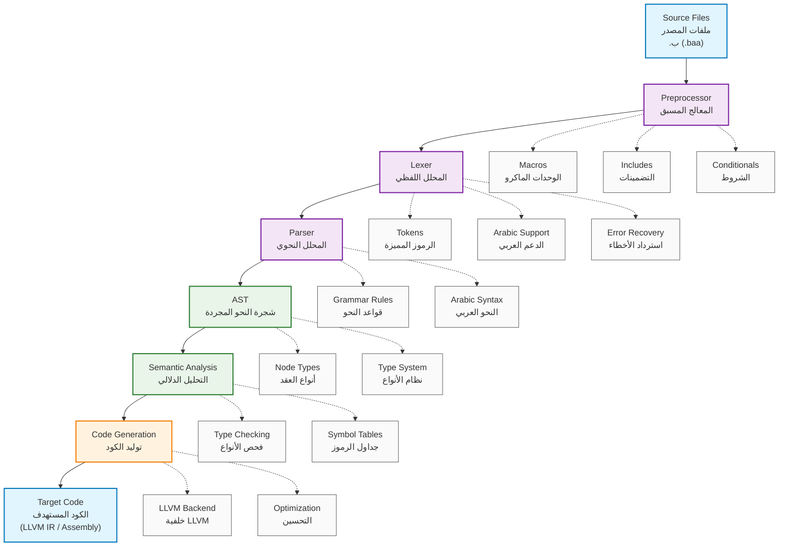

# Baa Compiler Architecture Visual Overview

**Available in:** [English](#) | [العربية](../02_معمارية_المترجم/نظرة_مرئية_شاملة.md)

**Status:** ✅ Complete  
**Last Updated:** 2025-01-09  
**Version Compatibility:** v1.0.0+  

## Overview

This document provides a visual overview of the Baa compiler architecture, showing how source code flows through different compilation phases to produce executable code.

## Compilation Pipeline



## Phase Descriptions

### 1. Source Files (ملفات المصدر)
- **Input**: Baa source files with `.ب` or `.baa` extension
- **Content**: Arabic/English mixed syntax
- **Encoding**: UTF-8 or UTF-16LE

### 2. Preprocessor (المعالج المسبق)
- **Purpose**: Handle preprocessor directives before compilation
- **Features**:
  - **Macros (الوحدات الماكرو)**: `#تعريف`, `#تعريف_دالة`
  - **Includes (التضمينات)**: `#تضمين`, `#تضمين_مرة`
  - **Conditionals (الشروط)**: `#إذا`, `#وإلا`, `#نهاية_إذا`
- **Output**: Preprocessed source code

### 3. Lexer (المحلل اللفظي)
- **Purpose**: Convert source code into tokens
- **Features**:
  - **Tokens (الرموز المميزة)**: Keywords, identifiers, literals, operators
  - **Arabic Support (الدعم العربي)**: Arabic identifiers, Arabic-Indic numerals
  - **Error Recovery (استرداد الأخطاء)**: Continue parsing after errors
- **Output**: Token stream

### 4. Parser (المحلل النحوي)
- **Purpose**: Build Abstract Syntax Tree from tokens
- **Features**:
  - **Grammar Rules (قواعد النحو)**: Recursive descent parsing
  - **Arabic Syntax (النحو العربي)**: Arabic keywords and constructs
- **Output**: AST (Abstract Syntax Tree)

### 5. AST (شجرة النحو المجردة)
- **Purpose**: Internal representation of the program structure
- **Features**:
  - **Node Types (أنواع العقد)**: Program, statements, expressions, types
  - **Type System (نظام الأنواع)**: `عدد_صحيح`, `عدد_حقيقي`, `حرف`, `منطقي`
- **Output**: Structured program representation

### 6. Semantic Analysis (التحليل الدلالي)
- **Purpose**: Validate program semantics and meaning
- **Features**:
  - **Type Checking (فحص الأنواع)**: Ensure type safety
  - **Symbol Tables (جداول الرموز)**: Variable and function resolution
- **Output**: Validated and annotated AST

### 7. Code Generation (توليد الكود)
- **Purpose**: Generate target machine code
- **Features**:
  - **LLVM Backend (خلفية LLVM)**: Modern code generation
  - **Optimization (التحسين)**: Performance improvements
- **Output**: Executable machine code

## Key Features by Phase

### Preprocessor Features
| Feature | Arabic Command | English Equivalent | Description |
|---------|----------------|-------------------|-------------|
| Include | `#تضمين "ملف.ب"` | `#include "file.h"` | Include external files |
| Define | `#تعريف ثابت ١٠` | `#define CONST 10` | Define constants |
| Conditional | `#إذا_عُرف تصحيح` | `#ifdef DEBUG` | Conditional compilation |

### Lexer Token Types
| Category | Arabic Examples | English Examples |
|----------|----------------|------------------|
| Keywords | `إذا`, `طالما`, `إرجع` | `if`, `while`, `return` |
| Types | `عدد_صحيح`, `حرف` | `int`, `char` |
| Identifiers | `المتغير`, `الدالة` | `variable`, `function` |
| Literals | `١٢٣`, `"نص"` | `123`, `"text"` |

### Parser Grammar Rules
```ebnf
program = { declaration } ;
declaration = function_declaration | variable_declaration ;
function_declaration = type identifier "(" parameter_list ")" block_statement ;
statement = expression_statement | if_statement | while_statement | return_statement ;
```

### AST Node Types
- **Program Node**: Root of the entire program
- **Statement Nodes**: `if`, `while`, `for`, `return`, `block`
- **Expression Nodes**: `binary_op`, `unary_op`, `function_call`, `identifier`, `literal`
- **Type Nodes**: `primitive_type`, `array_type`, `pointer_type`

## Error Handling Throughout Pipeline

### Lexer Errors
- Invalid character sequences
- Unterminated strings or comments
- Invalid numeric literals

### Parser Errors
- Syntax errors in language constructs
- Missing semicolons or braces
- Invalid expression syntax

### Semantic Errors
- Type mismatches
- Undefined variables or functions
- Scope violations

### Code Generation Errors
- Target-specific limitations
- Resource constraints

## Data Structures

### Token Structure
```c
typedef struct {
    BaaTokenKind kind;        // نوع الرمز المميز
    char* text;               // النص الأصلي
    BaaSourceSpan span;       // موقع المصدر
    union {
        int64_t integer;      // قيمة صحيحة
        double floating;      // قيمة حقيقية
        char* string;         // قيمة نصية
    } value;
} BaaToken;
```

### AST Node Structure
```c
typedef struct BaaNode {
    BaaNodeKind kind;         // نوع العقدة
    BaaSourceSpan span;       // موقع المصدر
    void* data;               // بيانات خاصة بالنوع
    struct BaaNode* parent;   // العقدة الأب
    struct BaaNode** children; // العقد الأطفال
    size_t child_count;       // عدد الأطفال
} BaaNode;
```

## Performance Characteristics

### Time Complexity
- **Lexing**: O(n) where n = source code length
- **Parsing**: O(n) for most constructs
- **Semantic Analysis**: O(n) with symbol table lookups
- **Code Generation**: O(n) with optimization passes

### Memory Usage
- **Tokens**: ~50-100 bytes per token
- **AST Nodes**: ~100-200 bytes per node
- **Symbol Tables**: ~50-100 bytes per symbol

## Integration Points

### External Dependencies
- **LLVM**: For code generation and optimization
- **System Libraries**: For I/O and standard functions
- **Platform APIs**: For system-specific features

### Output Formats
- **LLVM IR**: Intermediate representation for optimization
- **Assembly**: Human-readable assembly code
- **Object Files**: Compiled machine code
- **Executables**: Final runnable programs

## Debugging and Development Tools

### Compiler Flags
| Flag | Purpose | Example |
|------|---------|---------|
| `--dump-tokens` | Show lexer output | Token stream debugging |
| `--dump-ast` | Show parser output | AST structure debugging |
| `--dump-ir` | Show LLVM IR | Code generation debugging |

### Development Tools
- **AST Visualizer**: Graphical AST representation
- **Token Inspector**: Detailed token analysis
- **Error Reporter**: Enhanced error messages with Arabic support

## Future Enhancements

### Planned Features
- **Incremental Compilation**: Faster rebuild times
- **Language Server**: IDE integration
- **Advanced Optimization**: Better performance
- **Debugging Support**: Source-level debugging

### Research Areas
- **Arabic-Specific Optimizations**: Cultural programming patterns
- **Multilingual Error Messages**: Better developer experience
- **Performance Profiling**: Arabic identifier performance

## See Also

- [Lexer Documentation](LEXER.md) - Detailed lexical analysis
- [Parser Documentation](PARSER.md) - Syntax analysis details
- [AST Documentation](AST.md) - AST structure and usage
- [Code Generation](CODE_GENERATION.md) - Backend implementation

---

*This document is part of the [Baa Language Documentation](../NAVIGATION.md)*
